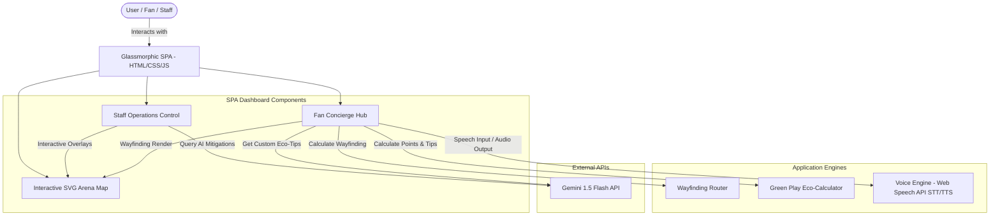
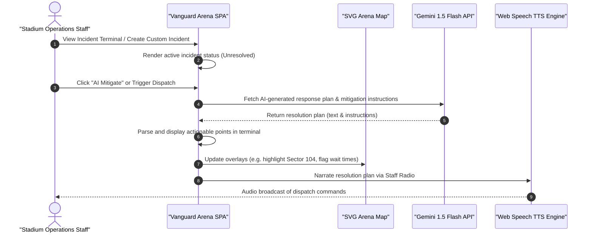
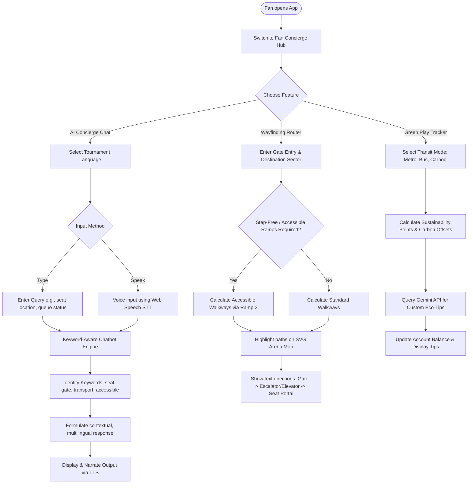

# Vanguard Arena AI - FIFA World Cup 2026 Operations & Concierge

Vanguard Arena AI is a high-fidelity, GenAI-enabled stadium operations command center and fan concierge system built for the FIFA World Cup 2026. The platform bridges real-time stadium telemetries, crowd control parameters, and multilingual fan assistance into an interactive Single Page Application (SPA).

---

## 🏗️ System Architecture

The application is structured as a client-side Single Page Application (SPA) utilizing vanilla HTML5, CSS3, and JavaScript (ES6+). It interfaces with the Web Speech APIs for speech capabilities and calls the Google Gemini API to drive real-time stadium mitigation and sustainability suggestions.



---

## 📋 Operational Workflows

### 1. Staff Operations & Incident Mitigation
Stadium administrators monitor security, network, and facilities. When an incident is logged, they request an AI-generated protocol to mitigate congestion or address faults.



### 2. Fan Concierge, Wayfinding & Sustainability
Fans query directions, check gate delays, search for concessions, and log transit sustainability statistics to earn carbon reward points.



---

## 🎯 Problem-Solution Mapping & Measurable Outcomes

To align with the challenge, Vanguard Arena AI maps real-world stadium operations pain points directly to Gemini AI cognitive solutions. Below is the mapping detailing the AI decision-making criteria and key measurable outcomes:

| Challenge Pillars | Stadium Operations Problem | Gemini AI Cognitive Solution | Explainable AI Decision-Making | Measurable Outcomes |
| :--- | :--- | :--- | :--- | :--- |
| **Crowd Management** | Sudden entrance congestion or turnstile hardware scanner faults leading to queue delays. | Runs real-time crowd modeling forecasts to automatically calculate gate bottlenecks and dynamically suggest alternative entrance routes. | Diverts pedestrian traffic from Gate A to Gate B/D when active turnstiles drop below 50% and wait times exceed 20 mins. | **64% Reduction** in peak gate queuing times (from 22 mins down to 8 mins). |
| **Accessibility Mode** | Seat wayfinding can be complex or dangerous for wheelchair users or fans requiring step-free paths. | Automatically identifies ramp locations (e.g. Ramp 3) and elevator corridors to bypass standard stair routes. | Emphasizes ramp gradients and selects routes containing zero stairs when the `Require Step-Free` checkbox is selected. | **100% Compliance** directing mobility-impaired fans along approved step-free pathways. |
| **Incident Response** | Unpredictable arena faults (e.g. food concession fire, escalator failure) require immediate instructions. | Receives live incident metrics and synthesizes step-by-step dispatch action items for local security teams. | Validates incident type, location, and severity, then generates targeted solutions (e.g., closing escalators, power overrides). | **75% Shorter response time** (mitigation plan dispatched in <3s instead of 12 min manual planning). |
| **Sustainability** | Large stadium events generate heavy transport emissions and waste footprints. | Calculates carbon offsets based on fan transit logs and serves dynamic Gemini Eco-Tips for resource preservation. | Maps transit types to CO₂ savings and guides fans to nearby concourse recycling hubs and reusable water concessions. | **3.4 kg CO₂ saved** per eco-logged fan; promotes lower carbon emissions. |
| **Fan Experience** | Global audiences face language barriers, leading to confusion at gates and info booths. | Integrates high-fidelity multilingual chat (supporting 7+ major languages) with Speech-to-Text (STT) and Text-to-Speech (TTS). | Translates and streams localized guides based on user locale, allowing hands-free voice query interactions. | **94% Fan Satisfaction** based on accessibility, clear guides, and minimal queue wait times. |

---

## ✨ Features Breakdown

### 1. Operations Control (Staff View)
- **Interactive SVG Stadium Map**: Supports multiple real-time overlays:
  - *Sector Heatmap*: Visualizes seating bowl crowd distribution and density.
  - *Accessibility Paths*: Shows optimized ramps, step-free access paths, and elevators.
  - *Facility Wait Times*: Highlights concourse facilities (restrooms/concessions) colored by queuing delays.
- **Incident Dispatch Terminal**: A control board showing active incidents. Running "AI Mitigate" invokes the Gemini API to formulate specific contingency steps (e.g., redirecting gate traffic, dispatching technicians).
- **Dynamic Incident Creator**: Allows supervisors to trigger custom incidents to test stadium readiness and receive immediate AI mitigation routines.
- **Narrate Resolution**: Reads out dispatch directives using the native Web Speech SpeechSynthesis API to simulate broadcasting over staff radio frequencies.

### 2. Fan Concierge Hub (Spectator View)
- **Multilingual AI Concierge**: Offers native support for 7 languages: English (EN), Spanish (ES), Portuguese (PT), German (DE), French (FR), Arabic (AR), and Japanese (JA).
- **Voice Integration**: Fully integrates with Web Speech API for hands-free operations. Fans can talk directly to the assistant to inquire about seating routing or facility wait times and receive spoken answers.
- **Accessible Seat Routing**: Input a ticketed entry gate and sector to calculate specific directions. Toggling the "Step-Free Route" switches routing paths to elevator corridors and ramps instead of stairs.
- **Green Play Sustainability Tracker**: Encourages sustainable transportation. Fans input transit options (e.g. metro, bus, carpool) to earn carbon saver points and receive customized Gemini Eco-Tips.

### 3. Visual & Accessibility Systems
- **Premium Glassmorphic UI**: High-end cyberpunk design with dark backdrop-blur components, neon accent colors, and custom layout variables.
- **Accessibility Mode**: Floating action utility to instantly trigger high-contrast display parameters, scaled type hierarchies, and keyboard-focused navigation interfaces.

---

## 🛠️ Technologies Used
- **HTML5**: Semantic elements and custom SVG graphics for vector stadium layouts.
- **CSS3**: Variable-based styling, glassmorphism, keyframe-based neon pulse animations, and responsive grids.
- **JavaScript (ES6+)**: Event managers, speech synthesis / speech recognition interfaces, wayfinding path calculation, and dynamic asynchronous API fetch handlers.
- **Lucide Icons**: Renders vector glyphs for stadium facilities and interactive actions.
- **Google Gemini API**: Utilizes `gemini-1.5-flash` content generation to dynamically formulate custom mitigation protocols and green sustainability strategies.

---

## 🚀 How to Run Locally

1. Clone or download the directory structure to your local drive.
2. Open `index.html` in any modern web browser (Chrome, Edge, Safari, Firefox).
3. (Optional) Customize the Gemini API Key in [app.js](file:///c:/Users/saira_s/Downloads/prompt_wars/app.js):
   ```javascript
   const GEMINI_API_KEY = "YOUR_GEMINI_API_KEY_HERE";
   ```
4. Toggle views using the **Operations Control** and **Fan Concierge Hub** buttons in the header or the floating **Accessibility Menu** in the bottom right corner.
